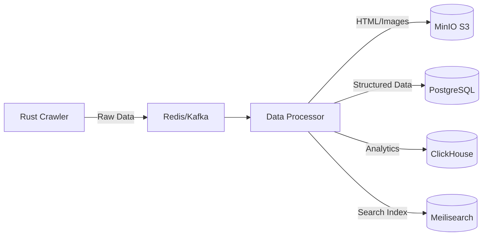

# 🧠 Production-Grade Upgrade Roadmap (Free/Open-Source)

This roadmap outlines how to upgrade the current Rust crawler to a production-grade data mining system using exclusively free and open-source tools.

## 1. Storage Options 💾

Moving beyond a single PostgreSQL instance to handle scale and different data types.

| Current | Upgrade Options | Why |
|---------|----------------|-----|
| PostgreSQL (single) | **PostgreSQL + TimescaleDB** | Free extension for time-series data, auto-compression. Good for job history. |
| | **ClickHouse** | Free columnar DB, insanely fast for analytics queries (OLAP). |
| | **MinIO** | Free S3-compatible object storage for raw HTML, screenshots, and large payloads. |
| | **SQLite** (for edge/local) | Zero-cost, file-based, great for distributed crawler nodes (WAL mode). |

**Recommended Stack**:
- **PostgreSQL**: Metadata, crawl jobs, status tracking.
- **MinIO**: Raw HTML dumps, screenshots, large payloads.
- **ClickHouse**: Analytics on deep extracted data.

## 2. Distributed Crawling 🕷️

Scaling from one machine to many.

| Component | Free Tool | Purpose |
|-----------|-----------|---------|
| **Job Queue** | **Redis** (free tier) / **RabbitMQ** | Distribute crawl jobs across workers. |
| | **BullMQ** / **Celery** | Task queue with retries, priorities (if using Python/Node sidecars). |
| **Orchestration** | **Apache Airflow** | Schedule, monitor, and retry complex crawl pipelines (ETL). |
| | **Temporal.io** | Workflow orchestration with strong durability guarantees. |

## 3. Proxy & Anti-Detection 🛡️

Staying under the radar without monthly fees.

| Current | Upgrade | Free Options |
|---------|---------|--------------|
| Basic rotation | **Residential Proxy Pools** | Free tier: **ProxyScrape**, **FreeProxyList** (requires heavy validation logic). |
| | **Tor** | Free, anonymous, but slow. Good for non-time-sensitive retry backup. |
| | **Cloud / VPS IPs** | Rotate between free tier VMs (AWS, GCP, Oracle) as exit nodes. |
| | **Cloudflare Workers** | 100K free requests/day. Can be used as a proxy gateway/fetcher. |

## 4. Web Server / Load Balancer 🌐

Handling incoming traffic and SSL.

| Feature | **Caddy (Current)** | Nginx | Traefik | Recommendation |
|---------|---------------------|-------|---------|----------------|
| **SSL/TLS** | **Automatic** (Zero Config) | Manual (Certbot) | Automatic | **Stick with Caddy** 🏆 |
| **Config** | Simple One-Liner | Verbose | YAML/Tags | **Caddy** |
| **Performance**| Excellent (Go) | Excellent (C) | Good (Go) | **Tie** (for 99% usage) |
| **Features** | Built-in metrics, zstd | Industry Standard | Native K8s | **Caddy** (Modern defaults) |

**Verdict**: **Stick with Caddy**.
It is fully production-grade, handles automatic HTTPS (critical for avoiding maintenance), supports HTTP/3 by default, and can load balance easily. Unless you are doing 100K+ RPS per node or need complex Lua scripting, Caddy is superior for ops simplicity.

## 5. Data Processing Pipeline 📊

Architecture for processing data asynchronously.

| Component | Free Tool |
|-----------|-----------|
| **Stream Processing** | **Apache Kafka** (self-hosted) or **Redis Streams**. |
| **NLP/Entity Extraction** | **spaCy** (Python), **NLTK**, **HuggingFace** open models. |
| **Deduplication** | **SimHash**, **MinHash** (Rust crates available). |
| **Search/Index** | **Meilisearch** (free, easiest setup) or **Elasticsearch** (OpenSearch). |
| **Data Cleaning** | **Great Expectations** (Python) for data validation rules. |

## 6. Monitoring & Observability 📈

Knowing what's happening in real-time.

| What | Free Tool |
|------|-----------|
| **Metrics** | **Prometheus** + **Grafana** (Industry standard, fully free self-hosted). |
| **Logs** | **Grafana Loki** (Log aggregation, integrates with Grafana). |
| **Tracing** | **Jaeger** or **Zipkin** (Distributed tracing for request bottlenecks). |
| **Alerting** | **Grafana Alerts** / **Alertmanager** (Discord/Slack webhooks). |

## 7. Infrastructure (Budget-Friendly) 🏗️

Where to host for free or cheap.

| Provider | Free Tier Benefits |
|----------|--------------------|
| **Oracle Cloud** | **4 ARM cores + 24GB RAM** (Always Free). Best value. |
| **AWS Free Tier** | 750 hrs t2/t3.micro per month (12 months). |
| **GCP Free Tier** | e2-micro (Always Free) + $300 credit. |
| **Hetzner** | Not free, but extremely cheap VPS (starting ~€4/mo). |
| **Fly.io** | 3 small VMs free (great for API/Workers). |
| **Railway/Render** | Free tiers for web services / PostgreSQL. |

## 8. Code Upgrades Needed 🔧

Refactoring `rust-crawler` for the new architecture.

| Area | Current | Upgrade Action |
|------|---------|----------------|
| **Database (`db.rs`)** | Single PostgreSQL | Add **SQLx connection pooling**, implement batched inserts for speed. |
| **Crawler (`crawler.rs`)** | Sync/Async Headless | Add **Browser Pool** management, parallel tab control. |
| **Job Management** | None (Direct API) | Add **Redis/Queue consumer** logic to fetch jobs. |
| **Caching** | None | Add **Redis cache** for deduplication and rate limiting state. |
| **Data Export** | JSON | Add **Parquet** or **CSV** export for efficient bulk data handling. |
| **API** | Basic | Add **Rate Limiting** (Tower middleware), API Keys. |
| **Health** | None | Add `/health` and `/ready` endpoints for k8s/orchestrators. |
| **Retries** | Google-specific | Generalize **Exponential Backoff** across all fetchers. |

## 9. Priority Upgrade Path 🎯

Recommended order of operations to maximize value.

### Phase 1: Foundation (Quick Wins) 🏁
- [ ] **Job Queue**: Add Redis to decouple crawling from API requests.
- [ ] **Storage**: Add MinIO (Docker) for storing raw HTML/Screenshots.
- [ ] **Monitoring**: Spin up Prometheus + Grafana container.
- [ ] **Deployment**: Deploy core stack to Oracle Cloud Free Tier.

### Phase 2: Scale & Reliability 🚀
- [ ] **Orchestration**: Implement workers (separate from API) scaling horizontally.
- [ ] **Analytics**: Add ClickHouse for querying crawl statistics.
- [ ] **Deduplication**: Implement SimHash to avoid re-crawling same content.
- [ ] **Scheduling**: Add Airflow (or simple cron-based scheduler) for recurring jobs.

### Phase 3: Advanced Intelligence 🧠
- [ ] **NLP**: Add a Python sidecar for entity extraction (spaCy) on crawled text.
- [ ] **Search**: Feed data into Meilisearch for full-text search capability.
- [ ] **Distribution**: Manage proxy rotation across multiple cloud regions.
