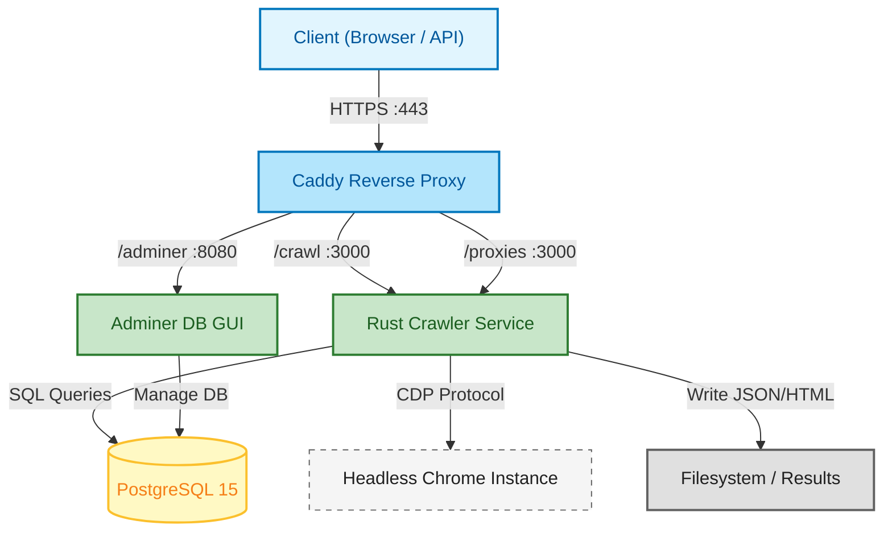

# Rust Crawler

Production-grade web crawler with **Google** and **Bing** search support, featuring proxy rotation, stealth mode, and true deep data extraction using Headless Chrome.

## Features

### Core Capabilities
- ✅ **Google & Bing Search** - First page results with exact match/verbatim support
- ✅ **True Deep Crawl** - Uses Headless Chrome for **both** SERP and target website extraction (executes JS, bypasses Cloudflare)
- ✅ **Resilient Extraction** - Automatic retries (up to 3x) for Google blocks/CAPTCHAs
- ✅ **Rich Data Extraction** - Captures:
  - Main Text (Readability + Fallbacks)
  - Metadata (Description, Authors, Keywords)
  - Schema.org (JSON-LD)
  - Open Graph Tags
  - Emails & Phone Numbers
  - Images & Outbound Links
- ✅ **Stealth Mode** - Bypasses webdriver detection, canvas fingerprinting, WebGL

### Dashboard 📊
- **Visual Interface**: Dark-themed dashboard at [`http://localhost:3000`](http://localhost:3000)
- **Live Monitoring**: View crawl status, results, and extract details in real-time.

### Proxy Rotation (Production-Grade)
- ✅ **Authenticated proxies** - Support for `user:pass@host:port` format
- ✅ **4 Rotation Strategies** - RoundRobin, LeastUsed, Random, Weighted
- ✅ **Health tracking** - Auto-disables proxies after consecutive failures
- ✅ **Runtime management** - Add/remove/enable proxies via API

---

## Quick Start

### 1. Environment Setup
```bash
cp .env.example .env
# Edit .env with your DATABASE_URL
```

### 2. Run with Docker Compose
```bash
cd /home/guest/tzdump/crawling
docker-compose up -d
```

### 3. Run Locally (Development)
```bash
cd rust-crawler
source .env
cargo run
```

### 4. Access Dashboard
Open your browser to: **`http://localhost:3000`**

### 5. API Testing
```bash
# Bing Search
curl -X POST http://localhost:3000/crawl \
  -H "Content-Type: application/json" \
  -d '{"keyword": "Top 5 Dota2 Players", "engine": "bing"}'

# Google Search (now with properties Retry)
curl -X POST http://localhost:3000/crawl \
  -H "Content-Type: application/json" \
  -d '{"keyword": "Top 5 Dota2 Players", "engine": "google"}'
```

---

## Configuration

### Environment Variables

| Variable | Description | Default |
|----------|-------------|---------|
| `DATABASE_URL` | PostgreSQL connection string | Required |
| `PROXY_LIST` | Comma-separated proxies | (empty = direct) |
| `PROXY_ROTATION` | roundrobin, leastused, random, weighted | roundrobin |
| `PROXY_MAX_FAILS` | Failures before proxy disabled | 3 |

### Proxy Format Examples
```bash
# Simple
PROXY_LIST="proxy1.com:8080,proxy2.com:3128"

# With authentication
PROXY_LIST="user:pass@premium-proxy.com:8080,user2:pass2@backup.com:3128"
```

---

## Data Structure

The crawler stores rich JSON data in the database.

### Crawl Result JSON (`results_json`)
```json
{
  "results": [
    {
      "title": "Example Result",
      "link": "https://example.com",
      "snippet": "Description text..."
    }
  ],
  "people_also_ask": ["Question 1?", "Question 2?"],
  "related_searches": ["Topic A", "Topic B"],
  "total_results": "About 1,000,000 results"
}
```

### Deep Extracted Content
Contains full text, HTML, and contacts extracted via Headless Chrome.

---

## Directory Structure
```
rust-crawler/
├── src/
│   ├── main.rs       # API server and routes
│   ├── api.rs        # API handlers & Dashboard Endpoint
│   ├── crawler.rs    # Core Logic (Google/Bing + Deep Extract)
│   ├── db.rs         # Database operations
│   └── proxy.rs      # Proxy rotation module
├── static/           # Dashboard HTML/CSS/JS
├── debug/            # Debug screenshots and HTML
├── logs/             # Application logs
├── crawl-results/    # Output files
└── Cargo.toml
```

## Changelog

### 2025-12-13
- **Refactor**: Deep Extractor now uses Headless Chrome (JS-Enabled)
- **Feature**: Google Search Retry Mechanism (Exponential Backoff)
- **UI**: Added Dark Mode Dashboard (`/tasks`)
- **Fix**: Resolved "Null" data issues on complex sites using browser-based extraction
- **Stealth**: Enhanced canvas/WebGL fingerprinting protection

---

## 🏗️ Deep Technical Architecture
For a comprehensive deep dive into the **Architecture**, **Dependency Graph**, **Internal Modules**, and **AI Tech Stack**, please refer to our **Official Technical Documentation**.

[](https://gist.github.com/pretamane/9f655f4502b257bae7d5e4dc41d16053)

> **[📄 View Full Technical Stack Documentation (Gist)](https://gist.github.com/pretamane/9f655f4502b257bae7d5e4dc41d16053)**

### Architecture Diagram


## License
MIT

