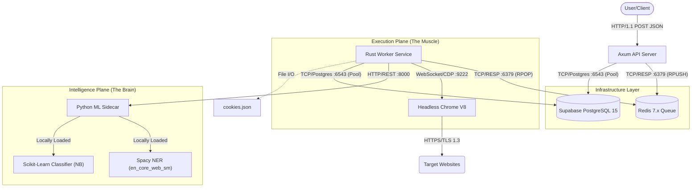
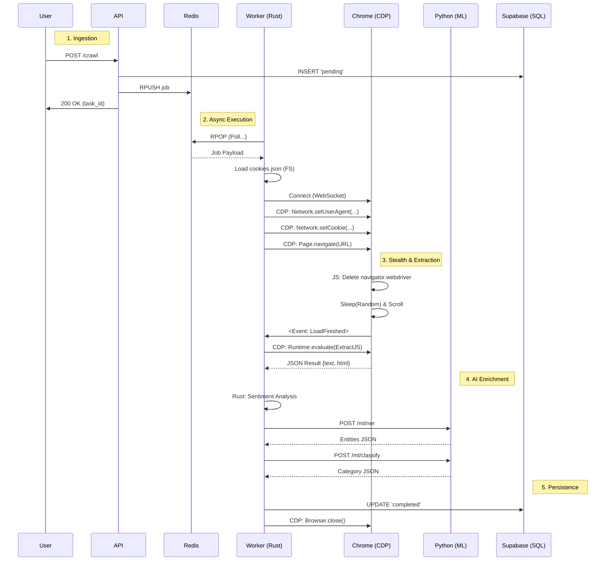

# System Architecture: Distributed Stealth Crawler (Technical Reference)

> **Engineering Note**: This specification details the high-performance distributed architecture of the crawler. It documents protocols, internal schemas, and specific implementation details for the Control, Data, and Intelligence planes.

## 1. High-Level Architecture
The system utilizes a **Microservices-inspired Event-Driven Architecture**. It separates the high-throughput Control Plane (API) from the high-latency Data Plane (Browser Workers) via an intermediate message broker.

### Service Interaction Map


---

## 2. Component Deep-Dive & Protocols

### 2.1 The Control Plane (API & Queue)
*   **Axum API (`rust-crawler`)**: 
    *   **Runtime**: Tokio Async Runtime (Multi-threaded).
    *   **Throughput**: Non-blocking IO allows handling thousands of concurrent requests.
    *   **Auth**: Bearer Token validation (optional middleware).
*   **Redis (Message Broker)**:
    *   **Protocol**: RESP (REdis Serialization Protocol).
    *   **Queue Pattern**: Producer-Consumer.
    *   **Keys**: `crawl_queue` (List).
    *   **Ops (Performance)**: 
        *   **Producer**: `lpush("crawl_queue", json)` **(O(1) - Constant Time)**.
            *   *Why it matters*: Pushing a job takes the same nanosecond-scale time whether the queue has 0 items or 10 million items. This guarantees the API never lags under heavy load.
        *   **Consumer**: Worker polls via `rpop` **(O(1) - Constant Time)**.
            *   *Why it matters*: Fetching the next job is instant. It simply detaches the tail element of the linked list. Cost does not increase with queue size.
    *   **Payload Schema**:
        ```json
        {
          "id": "uuid-v4",
          "keyword": "https://facebook.com/groups/...",
          "engine": "generic",
          "user_id": "uuid-v4"
        }
        ```

### 2.2 The Execution Plane (Worker & Browser)
*   **Rust Worker**: 
    *   **Concurrency**: Spawns independent `tokio::task` for each job (scalable).
    *   **Error Handling**: Exponential Backoff for network failures.
*   **Headless Chrome (`headless_chrome` crate)**:
    *   **Protocol**: Chrome DevTools Protocol (CDP) over WebSocket.
    *   **Stealth Implementation**: 
        *   **Flags**: `--disable-blink-features=AutomationControlled`, `--no-sandbox`.
        *   **CDP Method**: `Page.addScriptToEvaluateOnNewDocument` injects JS to delete `navigator.webdriver` before page load.
        *   **User Agent**: rotated per session via `Network.setUserAgentOverride`.
    *   **Authentication (Security Focus)**: 
        *   **CDP Method**: `Network.setCookie` injects array from `cookies.json`.
        *   **Domain Matching**: **Strict Key-based Substring Matching**.
            *   *Mechanism*: The worker iterates `cookies.json`. If the key is `facebook.com`, it allows injection into `www.facebook.com` or `m.facebook.com` but **never** into `google.com` or `face-book-phishing.com`.
            *   *Why it matters*: Prevents **Cross-Domain Session Leakage**, ensuring high-value session cookies are never sent to untrusted 3rd party trackers or wrong contexts.

### 2.3 The Intelligence Plane (AI/ML)
*   **Communication**: Internal HTTP/1.1 REST (`reqwest` -> `FastAPI`).
*   **Latency**: ~50-200ms per inference.
*   **Models Details**:
    *   **NER (Named Entity Recognition)**: 
        *   **Library**: `spaCy`.
        *   **Model**: `en_core_web_sm` (Small English pipeline).
        *   **Labels**: Extracts `PERSON`, `ORG`, `GPE`, `LOC`, `PRODUCT`, `EVENT`.
    *   **Classification**: 
        *   **Library**: `scikit-learn`.
        *   **Algorithm**: `MultinomialNB` (Naive Bayes).
        *   **Pipeline**: `CountVectorizer` (Bag of Words) -> `MultinomialNB`.
        *   **Note**: Currently uses an in-memory trained dummy model on startup for demonstration. Production ready for pickle-file loading.
*   **Schema (Internal API)**:
    *   **POST /ml/ner**: `{"text": "..."}` -> `{"entities": [{"text": "SpaceX", "label": "ORG"}]}`
    *   **POST /ml/classify**: `{"text": "..."}` -> `{"category": "Tech", "confidence": 0.95}`

### 2.4 ML Data Flow (Deep Details)
When the worker extracts text, the following specific sequence occurs:
1.  **Text Sanitization**: Rust strips HTML tags and normalizes whitespace.
2.  **Serialization**: The text string is JSON-encoded (e.g., `{"text": "Apple released... "}`).
3.  **Transport**: Sent via `POST` to `http://localhost:8000/ml/...`.
4.  **Inference (Python)**:
    *   **Spacy**: Tokenizes -> Tagger ->  Parser -> NER. This runs on CPU.
    *   **Sklearn**: Vectorizes (maps words to integers) -> Predicts Probabilities -> Returns `argmax` category.
5.  **Deserialization**: Rust parses the JSON response into typed Structs (`Vec<Entity>`, `ClassificationResponse`).

---

## 3. Detailed Service Specifications (Infrastructure & Core)

This section provides the low-level engineering parameters for the core services, derived from the source code implementation.

### 3.1 API Service (`src/main.rs`)
*   **Server Engine**: `axum` (built on `hyper` and `tower`).
*   **Connection Resilience**:
    *   **Retry Loop**: Implements a hard 15-attempt retry loop for initial Database Connection.
    *   **Delay**: 2-second linear backoff between attempts.
*   **Database Pooling (Supabase Optimized)**:
    *   **Pool Size**: Max `5` concurrent connections (Optimized for Transaction Pooler constraints).
    *   **Statement Cache**: `statement_cache_capacity(0)` (Explicitly disabled to prevent prepared statement ambiguity in PgBouncer).
    *   **Connection Lifecycle**: Executes `DEALLOCATE ALL` on every new connection acquisition to ensure a clean session state.
*   **Documentation**: Autosurfaces OpenAPI (Swagger) specs at `/rust-crawler-swagger`.

### 3.2 Browser Engine (`src/crawler.rs`)
*   **Launch Strategy**:
    *   **Mode**: `headless=new` (Chrome's modern headless implementation).
    *   **Isolation**: `--incognito` (Prevents cache/cookie leakage between sessions).
    *   **Metrics**: `--disable-dev-shm-usage` (Prevents crashes in Docker/Low-memory environments).
*   **Proxy Integration**:
    *   **Rotation**: Atomic Round-Robin (`PROXY_MANAGER.get_next_proxy()`).
    *   **Authentication**: Dynamically generates a temporary Chrome Extension (`manifest.json` + `background.js`) to inject `webRequest` headers for proxy auth, bypassing basic browser prompt limitations.
*   **Evasion Mechanics**:
    *   **Mouse**: Simulates Bezier-curve-like human movement from point A to B using CDP Input events.
    *   **Fingerprinting**: Overrides Timezone (`Asia/Yangon`) and Locale (`en-US`) to match specific residential IP profiles.

### 3.3 Database Schema Evolution (`src/db.rs`)
*   **Migration Pattern**: "Code-First Schema Evolution".
*   **Startup Check**:
    1.  Creates base `tasks` table if missing.
    2.  Iteratively executes `ALTER TABLE ... ADD COLUMN IF NOT EXISTS` for:
        *   `emails`, `phone_numbers`, `outbound_links` (JSONB)
        *   `marketing_data`, `entities` (JSONB)
        *   `sentiment`, `category` (TEXT)
    *   **Why**: Allows the application to upgrade the database schema automatically without external migration tools like Flyway.

---

## 4. Workflow Lifecycle (The 5 Phases)

### Phase 1: Ingestion & Validation
1.  **Request**: `POST /crawl` payload validted by Axum `Json<CrawlRequest>` extractor.
2.  **Persistence (Optimistic)**: `INSERT INTO tasks ... VALUES (..., 'pending')`.
3.  **Broker Handoff**: Job pushed to Redis. API returns `200 OK` + `task_id` immediately.

### Phase 2: Acquisition (The "Stealth" Phase)
4.  **Dequeue**: Worker wakes up on `BLPOP`.
5.  **Context**: 
    *   Reads `cookies.json` (Locked `RwLock` read).
    *   Spawns Chrome Process (`Command::new("google-chrome")`).
6.  **Injection**: `Network.setCookies(cookies)` executed.
7.  **Navigation**: `Page.navigate(url)` awaits `loadEventFired`.
8.  **Evasion**:
    *   **Entropy**: `sleep(rand(5000, 12000))` milliseconds.
    *   **Human Scroll**: `Runtime.evaluate` executes a JS loop that scrolls `window.scrollBy(0, rand(300, 700))` with jittery pauses.

### Phase 3: Extraction (DOM Interrogation)
9.  **Injection**: Rust reads `src/js/extract.js` and sends via `Runtime.evaluate`.
10. **Parsing Logic**:
    *   **Marketing**: `document.querySelectorAll('h1, h2, .benefit, .price')`.
    *   **Feed**: `document.querySelectorAll('div[role="feed"] > div')`.
11. **Serialization**: JS returns a standard JSON object `{ "headlines": [...], "posts": [...] }`.

### Phase 4: Enrichment (AI Processing)
12. **Native Analysis**: Rust `sentiment::analyze` (Keyword density algo, O(n)).
13. **Sidecar Inference**: 
    *   Worker sends extracted text to Python.
    *   Python loads model (cached in RAM).
    *   Inference runs on CPU.
    *   JSON response returned to Rust.

### Phase 5: Persistence & Notification
14. **Connection**: `sqlx::PgPool` acquires connection.
15. **Statement**: `UPDATE tasks SET ...`
    *   **Compatibility**: Executes `DEALLOCATE ALL` first to ensure compatibility with Supabase Transaction Pooler (PgBouncer).
16. **Cleanup**: Chrome process sent `SIGTERM` or `Browser.close`.

---

## 5. Sequence Diagram: The Life of a Crawl



---

## 6. Database Schema Reference (The Result)

Data is stored in the `tasks` table. We use `JSONB` for schema-less flexibility required by varying web structures.

| Column Name | Postgres Type | Description | Source |
| :--- | :--- | :--- | :--- |
| **`marketing_data`** | `JSONB` | Structured extraction. Keys: `headlines` (array), `benefits` (array), `ctas` (array). | DOM Scraping |
| **`entities`** | `JSONB` | List of objects: `[{ "text": "Apple", "label": "ORG" }]`. | Python Spacy |
| **`sentiment`** | `TEXT` | `Label (Score)` e.g., "Positive (0.85)". | Rust Native |
| **`category`** | `TEXT` | Single label e.g., "Technology". | Python FastText |
| **`extracted_text`** | `TEXT` | Full raw text content of the page. | DOM Body |
