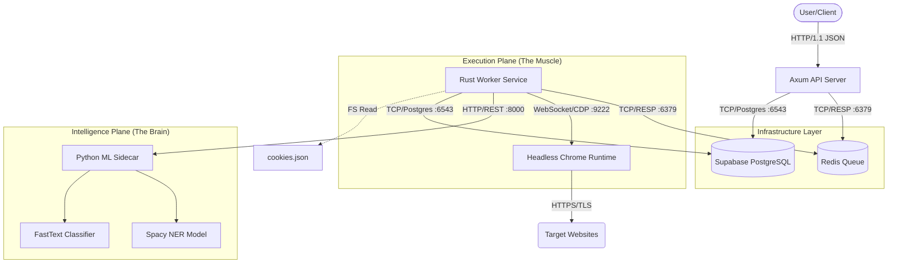
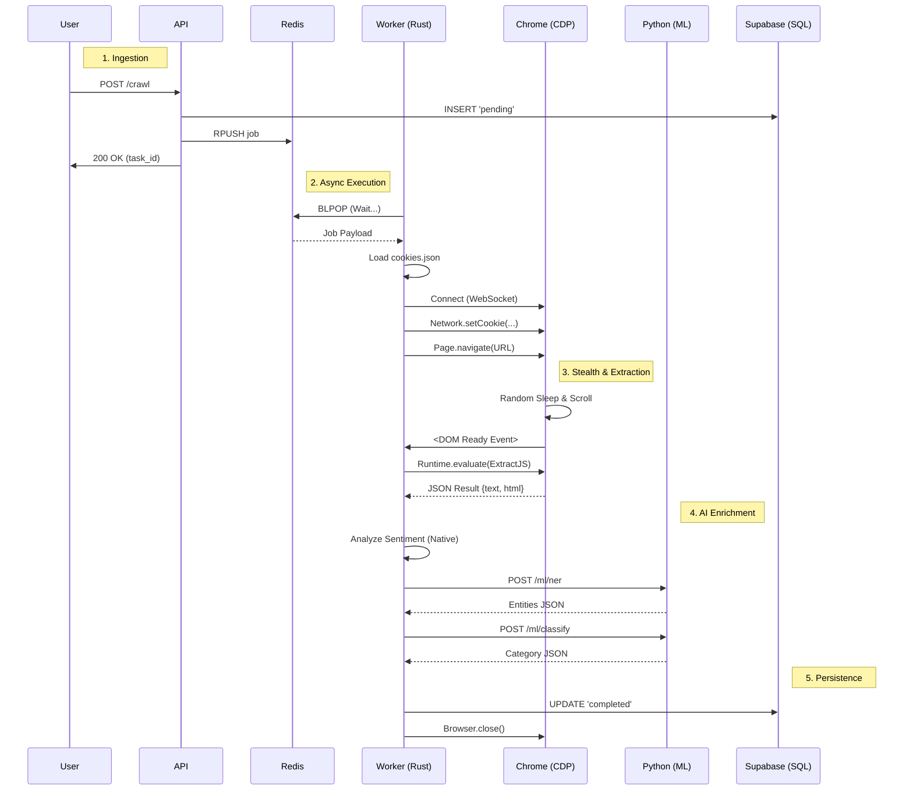

# System Architecture: Distributed Stealth Crawler

> **Note**: This document details the high-performance engineering architecture of the system. It covers the exact protocols, data flows, and lifecycle stages of the distributed crawler.

## 1. High-Level Architecture
The system employs a **Microservices-inspired architecture** (Control Plane vs. Data Plane) to ensure scalability and fault tolerance.

### Service Interaction Map (The "Brain" & "Muscle")

---

## 2. Component deep-Dive & Protocols

### 2.1 The Control Plane (API & Queue)
*   **Axum API**: Written in Rust for sub-millisecond latency. It acts as the gateway.
*   **Redis (Message Broker)**:
    *   **Protocol**: RESP (REdis Serialization Protocol).
    *   **Role**: Decoupling. The synchronous HTTP API pushes a job and returns immediately (`202 Accepted`). The asynchronous Worker picks it up when resources allow.
    *   **Data Structure**: List (`RPUSH queue:jobs`, `BLPOP queue:jobs`).

### 2.2 The Execution Plane (Worker & Browser)
*   **Rust Worker (`tokio`)**: The orchestrator. Single binary, highly concurrent.
*   **Headless Chrome (`CDP`)**:
    *   **Protocol**: Chrome DevTools Protocol over WebSocket.
    *   **Stealth**: We do *not* use Selenium/WebDriver. We inject JavaScript directly into the V8 context and manipulate `navigator` properties to spoof human fingerprints.
    *   **Cookies**: Injected via `Network.setCookie` method before navigation to bypass login barriers.

### 2.3 The Intelligence Plane (AI/ML)
*   **Protocol**: HTTP/1.1 REST (`reqwest` client).
*   **Python Sidecar (`FastAPI`)**:
    *   **Why Python?**: Access to PyTorch/Spacy ecosystem.
    *   **Flow**: Worker sends raw text -> Python performs CPU-bound inference -> Returns structured JSON.
    *   **Models**:
        *   **NER**: Spacy `en_core_web_sm` (extracts Orgs, People).
        *   **Classification**: FastText/Transformers (categorizes context).

---

## 3. Workflow Lifecycle (The 5 Phases)

### Phase 1: Ingestion & Validation
1.  **Request**: `POST /crawl` payload hits the API.
2.  **UUID**: A unique `task_id` is generated.
3.  **State**: `INSERT INTO tasks (id, status) VALUES (..., 'pending')`.
4.  **Enqueue**: Job is serialized to JSON and pushed to Redis.

### Phase 2: Acquisition (The "Stealth" Phase)
5.  **Dequeue**: Worker executes `BLPOP`, blocking until a job arrives.
6.  **Context**: Worker loads `cookies.json` (filesystem) for the target domain (e.g., Facebook).
7.  **Injection**: Browser launches. Cookies are injected. User Agent is spoofed.
8.  **Navigation**: `Page.navigate(url)`.
9.  **Evasion**:
    *   **Random Sleep**: `sleep(uniform_dist(5.0, 12.0))`
    *   **Human Scroll**: Randomized scroll steps to trigger `IntersectionObserver` lazy-loading.

### Phase 3: Extraction (DOM Interrogation)
10. **Injection**: Custom JavaScript is compiled and sent via `Runtime.evaluate`.
11. **Parsing**:
    *   **Marketing**: Selectors target `h1`, `h2`, `.benefits`, `.pricing`.
    *   **Feeds**: Selectors target `div[role="article"]` for social posts.

### Phase 4: Enrichment (AI Processing)
12. **Native**: Rust performs keyword-based Sentiment Analysis.
13. **Foreign**: Rust `POST`s text to Python Sidecar.
    *   **Input**: "SpaceX launched a rocket."
    *   **Output**: `{"entities": [{"text": "SpaceX", "label": "ORG"}]}`

### Phase 5: Persistence & Notification
14. **Transactions**: Final data is aggregated.
15. **SQL**: `UPDATE tasks SET status='completed', marketing_data=$1, entities=$2 ...`
    *   **Connection**: Uses Supabase Transaction Pooler (Port 6543).

---

## 4. Sequence Diagram: The Life of a Crawl

---

## 5. Database Schema Reference (The Result)

Data is stored in the `tasks` table with specific strongly-typed columns and JSONB containers for flexibility.

| Column Name | Type | Description | Source |
| :--- | :--- | :--- | :--- |
| **`marketing_data`** | `JSONB` | Structured extracting of "Selling Points, Headlines, Benefits". | DOM Scraping |
| **`entities`** | `JSONB` | List of extracted People, Organizations, Locations. | Python NER |
| **`sentiment`** | `TEXT` | Sentiment Label (Positive/Negative) + Score. | Rust Analysis |
| **`category`** | `TEXT` | AI-classified topic (e.g., "Technology"). | Python Classifier |
| **`extracted_text`** | `TEXT` | Full raw text content of the page. | DOM Body |
