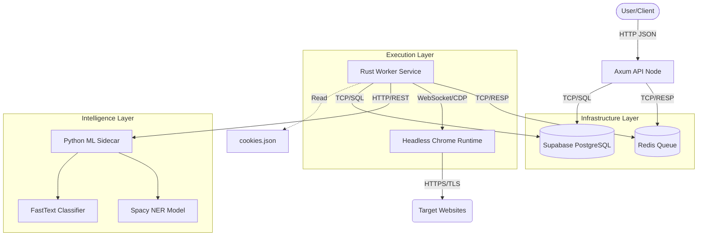
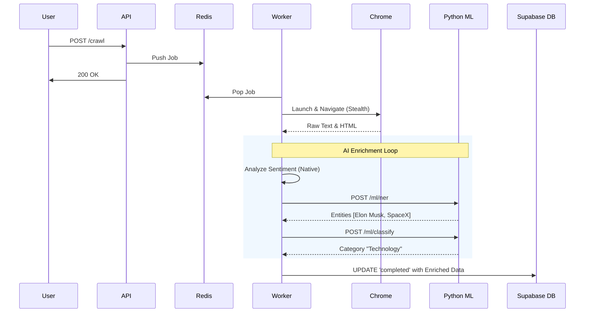

# System Architecture & Workflow Analysis

## 1. High-Level Architecture Overview
This system is a distributed, stealth-oriented web crawler built in Rust. It mimics human behavior to scrape data from anti-bot platforms (Facebook, Google) and integrates with an **AI/ML Sidecar** for intelligent content analysis.

### Service Interaction Map

---

## 2. Tool & Service Interconnections

1.  **API/Worker <-> Redis (`TCP / RESP`)**
    *   **Mechanism**: Rust `redis-rs` pushes jobs to `queue:jobs`. Decouples ingestion from processing.

2.  **Worker <-> Chrome (`WebSocket / CDP`)**
    *   **Mechanism**: Rust `headless_chrome` spawns `chrome` and controls it via DevTools Protocol. Drives navigation, injection, and extraction.

3.  **Worker <-> Python Sidecar (`HTTP / REST`)**
    *   **Why**: Rust is great for speed/safety, but Python is king for ML libraries.
    *   **Mechanism**: Rust Worker makes HTTP POST requests to `localhost:8000` (FastAPI).
    *   **Payload**: `{ "text": "extracted content..." }`.
    *   **Response**: `{ "entities": [...], "category": "Tech", "confidence": 0.98 }`.

4.  **Worker <-> Supabase (`TCP / Postgres Wire`)**
    *   **Mechanism**: Rust `sqlx` connects to the Transaction Pooler (port 6543). Stores final enriched data.

---

## 3. Workflow Lifecycle (Step-by-Step)

### Phase 1: Ingestion
1.  **User**: `POST /crawl` -> API.
2.  **API**: Generates `task_id`, saves `pending` status to DB, pushes to Redis.

### Phase 2: Execution & Stealth
3.  **Worker**: Pops job, loads `cookies.json` for the target domain.
4.  **Browser**: Launches in Headless Mode with stealth flags.
5.  **Safety**: Checks for Captchas. Sleeps randomly (5-12s) to mimic human latency.
6.  **Navigation**: Human-like scrolling to trigger lazy-loads (especially for Facebook).

### Phase 3: Extraction
7.  **JS Injection**: Runs scripts in-browser to identify "Selling Points" (Headlines, Benefits) and Feed Posts.
8.  **Data Return**: structured JSON returns to Rust.

### Phase 4: AI Enrichment (The Brain)
9.  **Sentiment**: Rust runs a native keyword-based sentiment analysis (`Positive`/`Negative`).
10. **NER**: Rust sends text to Python Sidecar to extract People, Orgs, Locations using **Spacy**.
11. **Classification**: Rust sends text to Python Sidecar to categorize content (e.g., "Business", "Tech").

### Phase 5: Persistence
12. **Storage**: Enriched data (Marketing + ML Tags) is saved to Supabase `tasks` table (`marketing_data` column).

---

## 4. Sequence Diagram (The Flow)

---

## 5. Security & Data
*   **Credentials**: `cookies.json` and `.env` are git-ignored.
*   **Isolation**: Browser runs in a sandbox; ML runs in a local sidecar. No data leaves your infrastructure.
